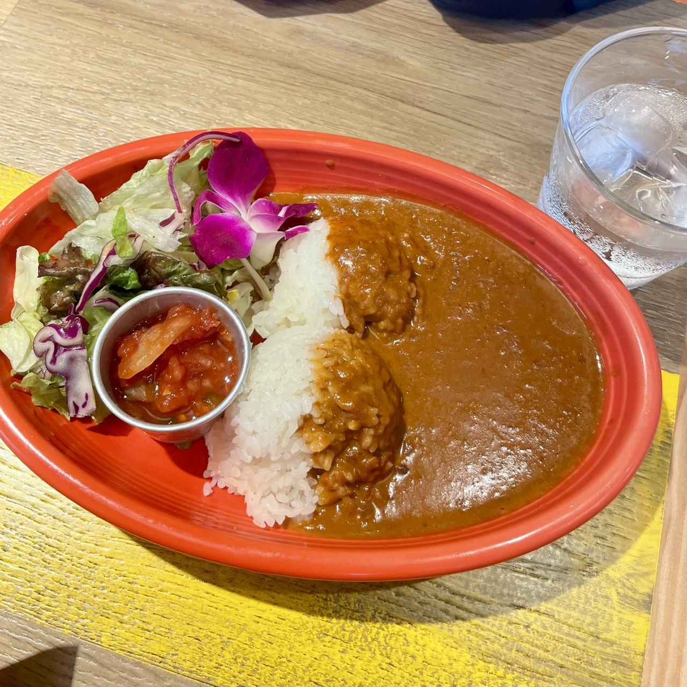
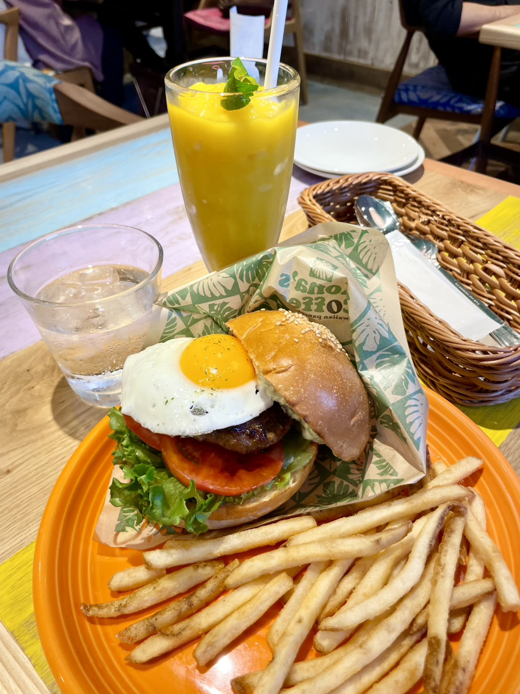
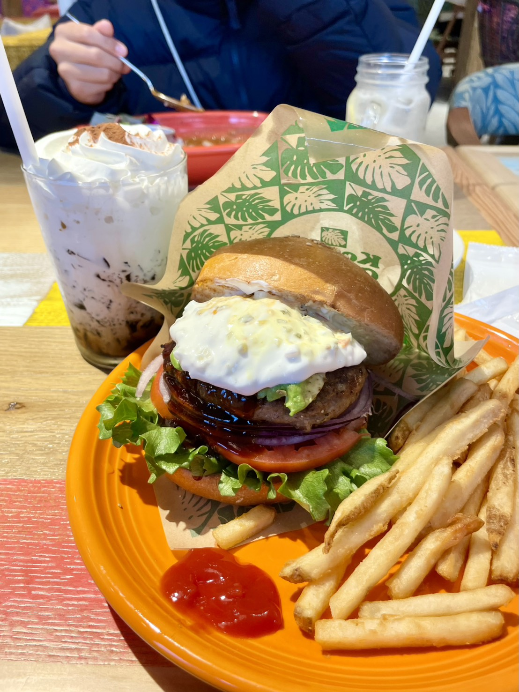

## コナズ珈琲って知ってる？

ハワイアンな雰囲気のカフェレストラン、**コナズ珈琲**に家族で行ってきた。

前から気になってたんだけど、今日やっと行けた！

## 14時過ぎで25組待ち...!?

着いたのは14時過ぎ。ランチのピーク終わってるだろうと思ったら甘かった。

**25組待ち。約1時間。**

でも近くに公園があったから、そこで時間を潰した。天気も良かったしちょうどよかった。

ちなみにコナズ珈琲は**ワンちゃんも入れる席がある**らしい。犬飼ってる人にはめっちゃいいと思う。

## 僕が頼んだもの：ココナッツカレー

- **ココナッツカレー** — 1,199円
- **クラフトレモネードソーダ** — 715円

僕は**ココナッツカレー**を注文。

ココナッツの甘さとスパイスが効いてて、普通のカレーとは全然違う。ハワイアンな感じがする。サラダとサルサソースも付いてて、味変できるのが良い。

ドリンクは**クラフトレモネードソーダ**にした。甘いだけじゃなくて**苦味もあって、ちょっと大人な味**だった。これはリピートしたい。

## 母と妹はハンバーガー

- **アボカドバーガー** — 1,859円
- **珈琲ゼリーラテ** — 770円

母は**アボカドバーガー**と**珈琲ゼリーラテ**を注文。

珈琲ゼリーラテ、机に置いてあった**コーヒー豆をミルで自分で砕いてかけられる**んだけど、それをやるとまた珈琲の風味が増してめちゃくちゃ美味しかったらしい。

- **テリヤキバーガー** — 1,749円
- **マンゴーパッションスムージー** — 935円

妹は**テリヤキバーガー**と**マンゴーパッションスムージー**。目玉焼きが乗ってて見た目もすごい。マンゴーパッションスムージーはマンゴーが濃くてめちゃくちゃ美味しかった！

**家族3人で合計7,227円！**

## 結局全部食べたのは僕だけ

ハンバーガー、でかすぎて**母も妹も半分残してた**。

...で、**残り全部僕が食べたw**

ココナッツカレー1人前＋ハンバーガー半分×2。もぐもぐ投資家の名に恥じない食べっぷり。

## まとめ

- コナズ珈琲、雰囲気も料理も最高
- 14時過ぎでも25組待ちだから、時間に余裕を持って行くべし
- 近くに公園があると待ち時間が楽
- ワンちゃんOK席あり
- ココナッツカレーは普通のカレーと全然違っておすすめ
- クラフトレモネードソーダは大人っぽい味で好き
- ハンバーガーはでかいので覚悟して頼もう

また行きたい！次は別のメニュー攻めてみる。

---

#コナズ珈琲 #ハワイアンカフェ #ココナッツカレー #ハンバーガー #グルメレポ #中学生グルメ #カフェ巡り
